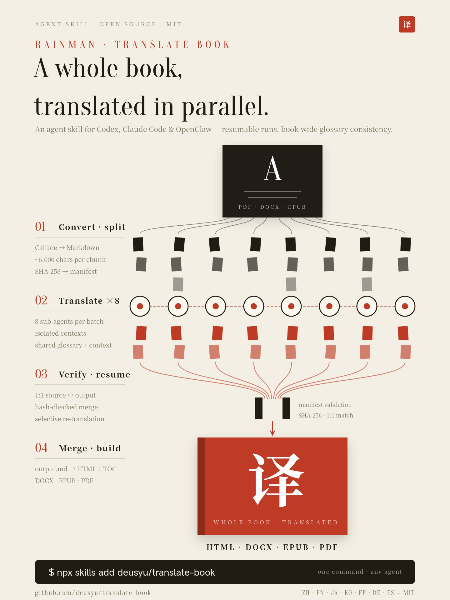

# Good Translate

English | [中文](README.zh-CN.md)

An agent skill for Codex, Claude Code, and OpenClaw that translates entire books (PDF/DOCX/EPUB) into any language using parallel subagents.

The reliable PDF path preserves measured page size, margins, typography, heading color/scale, source column count, complete figures and captions, tables, and formulas. It produces Chinese and interleaved bilingual HTML/PDF by default. DOCX/EPUB inputs remain supported through the legacy structure-preserving route.

<p align="center">
  
</p>

> Inspired by [claude_translater](https://github.com/wizlijun/claude_translater). The original project uses shell scripts as its entry point, coordinating the Claude CLI with multiple step scripts to perform chunked translation. This project restructures the workflow as an agent skill for Codex, Claude Code, and OpenClaw, using subagents to translate chunks in parallel, with manifest-driven integrity checks, resumable runs, and multi-format output unified into a single pipeline. As the project structure and implementation differ significantly from the original, this is an independent project rather than a fork.

---

## How It Works

```
PDF input
  │
  ▼
Preflight → geometry / MinerU / OCR + MinerU
  │
  ▼
Block-addressed doc.json + measured style.json + source crops
  │  complete v2 manifest tracks source, blocks, chunks and hashes
  ▼
Parse visual acceptance → resumable parallel chunk translation
  │  each dispatch snapshots language, style prompt, glossary and source
  ▼
Merge observations → selective terminology correction → freeze
  │
  ▼
Versioned browser render → DOM checks → page contact sheets → visual acceptance
```

Each chunk gets its own independent subagent with a fresh context window. This prevents context accumulation and output truncation that happen when translating a full book in a single session.

## Features

- **Parallel subagents** — 8 concurrent translators per batch, each with isolated context
- **Resumable + selective re-translation** — chunk-level resume, with `run_state.json` tracking glossary-sensitive re-translation
- **Neighbor context** — each chunk can see short read-only excerpts from adjacent chunks for pronoun and entity resolution
- **Manifest validation** — SHA-256 hash tracking prevents stale or corrupt outputs from being merged
- **Source-style PDF output** — measured page/typography/heading/column styling, with full source crops for independent formulas and visual objects
- **Three Publishing Editions** — default automatic rendering for all three formats:
  1. **Original Journal Edition** (`{Title}_期刊原版.pdf`): High-fidelity 2-column or 1-column layout;
  2. **Interleaved Bilingual Edition** (`{Title}_双语对照.pdf`): Paragraph-by-paragraph aligned bilingual layout;
  3. **Chinese Official Document Edition** (`{Title}_公文版.pdf`): Conforming to **GB/T 9704—2012** (red header, red divider line, standard font size & line spacing) and **GB/T 7714** (10pt compact hanging indent references).
- **Academic Metadata Retrieval Gate** — Rejects silent code fallbacks and random hash placeholders (e.g. `学术期刊译情参阅 编号：39e516e484da`). The Agent actively uses web/academic search tools when paper metadata is incomplete to retrieve the official journal venue (e.g. *Nature Neuroscience*), canonical DOI, and publication year for formal red headers.
- **Zero Red Math Error Gate (v2.2)** — Playwright rendering layer deeply scans MathJax DOM elements (`mjx-merror`, `[mathcolor="red"]`, `[data-mjx-error]`) to block raw OCR-corrupted LaTeX syntax, with automated dual-side math sanitization ensuring 0 rendering errors across all editions.
- **Post-Reference Boundary & Appendices Isolation (v2.2)** — Recognizes back-matter structures following references (e.g., STAR Methods, Methods Details, Appendices in *Neuron* / *Cell* papers), strictly closing the reference parser and enforcing standard 16pt body typography to eliminate hanging-indent style contamination.
- **Multi-Scale Visual QA Protocol (v2.2)** — Prohibits low-resolution thumbnail sign-offs; requires dual-scale verification combining macro contact sheets with 1:1 / 2.0x high-resolution slice reviews on formula-dense and section-boundary pages.
- **Standard Semantic Naming** — automatically extracts clean titles with edition suffixes and preserves backward-compatible aliases.
- **Two explicit acceptance gates** — parsing and publication cannot become complete from file existence or automated rendering alone
- **Multi-format output** — translated, interleaved bilingual, and official document HTML/PDF by default; DOCX/EPUB on request
- **Optional output controls** — explicit EPUB cover, custom temp root, and user-facing export aliases
- **Multi-language** — zh, en, ja, ko, fr, de, es (extensible)
- **PDF/DOCX/EPUB input** — reliable source-style mode for PDF; compatibility conversion for DOCX/EPUB

## Prerequisites

- **Agent runtime** — Codex, Claude Code, or OpenClaw, installed and ready to run skills
- **uv + Python 3.12** — dependencies are locked in `uv.lock`; use `uv sync`
- **Edge/Chromium** — deterministic HTML checks and PDF printing
- **MinerU** — required for formula-heavy or multi-column PDFs
- **OCR dependencies** — OCRmyPDF, Tesseract language packs, and Ghostscript for scanned PDFs
- **Calibre/Pandoc** — required only for legacy DOCX/EPUB conversion or optional DOCX/EPUB publication

## Quick Start

### 1. Install the skill

#### Codex

```bash
npx skills add Jacksonzhang320/good-translate -a codex -g
```

Or install it manually:

```bash
mkdir -p ~/.agents/skills
git clone https://github.com/Jacksonzhang320/good-translate.git ~/.agents/skills/good-translate
```

Restart Codex if the newly installed skill does not appear.

#### Claude Code

```bash
npx skills add Jacksonzhang320/good-translate -a claude-code -g
```

Or install it manually:

```bash
mkdir -p ~/.claude/skills
git clone https://github.com/Jacksonzhang320/good-translate.git ~/.claude/skills/good-translate
```

#### OpenClaw

```bash
openclaw skills install @Jacksonzhang320/good-translate
```

### 2. Translate a book

#### Codex

In the Codex CLI or IDE extension, enter:

```text
$good-translate Translate /path/to/book.pdf into Chinese.
```

Codex can also select the skill automatically when your request matches its description.

#### Claude Code and OpenClaw

Ask the agent:

```text
translate /path/to/book.pdf to Chinese
```

In Claude Code, you can also use the slash command:

```text
/good-translate translate /path/to/book.pdf to Japanese
```

The skill routes the source, translates in resumable batches, closes terminology feedback, and renders the requested editions. A run is complete only after page-level visual acceptance.

### 3. Find your outputs

Reliable PDF files are recorded in `<run>/build_result.json` and live under `<run>/publish/<render-hash>/`:

| File | Description |
|------|-------------|
| `book.html` | Translated source-style web edition |
| `book.pdf` | Translated source-style PDF |
| `book_bilingual.html` | Interleaved original + translation web edition |
| `book_bilingual.pdf` | Interleaved original + translation PDF |

`generated` means the files passed mechanical checks. `accepted` means their page contact sheets were also reviewed with concrete evidence. Use `scripts/pipeline.py status <run>` as the completion check.

## Repository Test Assets

- Checked-in baseline inputs live under `tests/baselines/<book-id>/`.
- Generated full-pipeline outputs live under `tests/.artifacts/` and should not be committed.
- Because `scripts/convert.py` writes `{book_name}_temp/` under the current working directory, run repository baseline tests from inside `tests/.artifacts/` to keep generated files out of the repo root.

### Full-Pipeline Baseline Example

```bash
mkdir -p tests/.artifacts
cd tests/.artifacts
python3 ../../scripts/convert.py ../baselines/standard-alice/standard-alice.epub --olang zh
# then run translation via the skill
python3 ../../scripts/merge_and_build.py --temp-dir standard-alice_temp --title "test"
```

## Feedback and Contributions

Please open a detailed GitHub issue instead of starting with a pull request. This project is maintained as an AI-assisted skill pipeline, and changes need to be evaluated against the current orchestration rules, chunk/manifest contracts, baseline assets, and release flow in one maintainer-owned context.

Pull requests are not the preferred contribution path and may be closed in favor of an issue. If you already have a patch, include the idea, key diff, failing case, or verification notes in the issue; the maintainer may rework or split the implementation before merging.

A useful issue should include:

- Current behavior and expected behavior
- Input format and environment, such as PDF/DOCX/EPUB, OS, Python, Calibre, and Pandoc versions
- Minimal reproduction steps or a small public-domain sample when possible
- Logs, screenshots, or generated file names that show the failure

## Pipeline Details

### Step 1: Convert

```bash
python3 scripts/convert.py /path/to/book.pdf --olang zh
```

Calibre converts the input to HTMLZ, which is extracted and converted to Markdown, then split into chunks (~6000 chars each). A `manifest.json` records the SHA-256 hash of each source chunk for later validation, and a `source_fingerprint.json` ties the temp dir to the exact source bytes it was built from — re-running against a replaced source file aborts instead of silently reusing stale chunks. Temp dirs created before fingerprinting are adopted with a warning on first re-run.

By default the working directory is `{book_name}_temp/` under the current directory. Use `--temp-root /path/to/work` to keep the same leaf directory name under a different parent.

### Step 1.5: Glossary (term consistency across chunks)

Each chunk is translated by a fresh-context sub-agent, which means the same proper noun can drift across multiple translations on a 100-chunk book. To fix this, the skill builds a glossary before translation:

1. Sample 5 chunks (first, last, 3 evenly-spaced middle).
2. Extract proper nouns and recurring domain terms; pick canonical translations.
3. Write `<temp_dir>/glossary.json` (hand-editable schema below).
4. Run `python3 scripts/glossary.py count-frequencies <temp_dir>` to populate per-term frequencies (ASCII terms use word-boundary regex so `cat` doesn't match `category`; CJK terms use substring; single-CJK-char terms are rejected; aliases count toward the term they belong to).
5. For each chunk, the orchestrator calls `python3 scripts/glossary.py print-terms-for-chunk <temp_dir> chunkNNNN.md` and injects the resulting 3-column (`原文 | 别名 | 译文`) markdown table into that chunk's prompt as a hard constraint. Term selection = (terms whose source OR any alias appears in this chunk) ∪ (top-N most-frequent book-wide).

```json
{
  "version": 2,
  "terms": [
    {"id": "Manhattan", "source": "Manhattan", "target": "曼哈顿",
     "category": "place", "aliases": [], "gender": "unknown",
     "confidence": "medium", "frequency": 12,
     "evidence_refs": [], "notes": ""}
  ],
  "high_frequency_top_n": 20,
  "applied_meta_hashes": {}
}
```

Existing v1 `glossary.json` files are auto-upgraded to v2 on first load. v2 forbids the same surface form (source or alias) appearing in two different terms; if a v1 file has polysemous duplicate sources, the upgrade aborts with a disambiguation message — fix the file by hand and reload.

Edit `glossary.json` between runs to fix translations; existing `glossary.json` is never overwritten — delete it to rebuild from scratch. `scripts/run_state.py` records which glossary terms each chunk used, so later glossary changes (including `target`, `category`, and `aliases` edits) only re-translate affected chunks after the state has been recorded.

### Step 2: Translate (parallel subagents)

The skill launches subagents in batches (default: 8 concurrent). Each subagent:

1. Reads one source chunk (e.g. `chunk0042.md`)
2. Translates to the target language
3. Uses a per-chunk term table and short read-only previous/next excerpts
4. Writes the result to `output_chunk0042.md`
5. Writes `output_chunk0042.meta.json` observations for glossary feedback

Before launching subagents, `scripts/run_state.py plan <temp_dir>` decides which chunks need translation, which existing outputs only need state recording, and which are unchanged. Use `--retranslate-untracked` only when adopting an old temp dir whose existing outputs should be forced through the current glossary. If a run is interrupted, re-running skips chunks that already have valid output files and current state. Failed chunks are retried once automatically.

### Step 3: Merge & Build

```bash
python3 scripts/merge_and_build.py --temp-dir book_temp --title "《translated title》"
```

Optional output flags:

```bash
python3 scripts/merge_and_build.py --temp-dir book_temp --title "《translated title》" --cover cover.jpg --export-name "translated-title"
```

`--cover` passes an explicit image to the EPUB Calibre step. `--export-name` creates alias copies such as `translated-title.epub` while preserving the canonical `book.*` pipeline artifacts.

Before merging, the script validates:
- Every source chunk has a corresponding output file (1:1 match)
- Source chunk hashes match the manifest (no stale outputs)
- No output files are empty, blank (whitespace-only), or unreadable — a blank chunk aborts the merge instead of silently dropping its content

Then: merge → Pandoc HTML → inject TOC → Calibre generates DOCX, EPUB, PDF.

**Legacy-route note:** `{book_name}_temp/` is a working directory for one DOCX/EPUB compatibility run. Reliable PDF runs use a fresh short run ID and content-addressed publication directories; do not delete prior evidence to force a rebuild.

## Project Structure

| File | Purpose |
|------|---------|
| `SKILL.md` | Agent skill definition — orchestrates the full pipeline |
| `scripts/convert.py` | PDF/DOCX/EPUB → Markdown chunks via Calibre HTMLZ |
| `scripts/pipeline.py` | Reliable PDF preflight, parse/dispatch/publish gates, status, acceptance and cleanup |
| `scripts/pdf_document.py` | PDF/MinerU/OCR geometry → block-addressed document, measured style and source crops |
| `scripts/publish.py` | Content-addressed source-style HTML/PDF publisher |
| `scripts/qa_preview.py` | Source/object/output page contact sheets for visual review |
| `scripts/manifest.py` | Chunk manifest: SHA-256 tracking and merge validation |
| `scripts/glossary.py` | Glossary management: per-chunk term tables for consistent terminology |
| `scripts/chunk_context.py` | Read-only previous/next chunk excerpts for sub-agent prompts |
| `scripts/meta.py` | Per-chunk sub-agent observation file schema (`output_chunkNNNN.meta.json`) |
| `scripts/merge_meta.py` | Batch-boundary merge: sub-agent observations → canonical glossary |
| `scripts/run_state.py` | Selective re-translation planner and `run_state.json` recorder |
| `scripts/merge_and_build.py` | Merge chunks → HTML → DOCX/EPUB/PDF |
| `scripts/calibre_html_publish.py` | Calibre wrapper for format conversion |
| `scripts/template.html` | Web HTML template with floating TOC |
| `scripts/template_ebook.html` | Ebook HTML template |
| `tests/baselines/` | Checked-in baseline book inputs for full-pipeline testing |
| `tests/.artifacts/` | Ignored full-pipeline test outputs |

## Troubleshooting

| Problem | Solution |
|---------|----------|
| `Calibre ebook-convert not found` | Install Calibre and ensure `ebook-convert` is in PATH |
| `Manifest validation failed` | Source chunks changed since splitting — re-run `convert.py` |
| `was created from different source bytes` | The temp dir belongs to a different source file — delete the temp dir or use a fresh `--temp-root` |
| `Blank output` / `Empty output` | A subagent wrote a whitespace-only or empty chunk — re-run the skill to re-translate it |
| `Missing source chunk` | Source file deleted — re-run `convert.py` to regenerate |
| Incomplete translation | Re-run the skill — it resumes from where it stopped |
| Changed title/template/assets but output didn't update | Delete existing `output.md`, `book*.html`, `book.docx`, `book.epub`, `book.pdf` from the temp dir, then re-run `merge_and_build.py` |
| Want page-number footers stripped from PDF output | By default, monotonic page-number sequences (e.g. `1, 2, 3, ...`) are auto-detected and dropped while outliers like years (`1984`), chapter numbers, and citation indices stay preserved. If detection misses your case, pass `--strip-page-numbers` to `convert.py` to aggressively delete every standalone-digit line. The flag aborts if a cached `input.md` or `chunk*.md` already exists — delete them first so the flag actually takes effect. |
| `output.md exists but manifest invalid` | Stale output — the script auto-deletes and re-merges |
| `Glossary upgrade rejected: duplicate source` | v2 disallows two terms sharing a source/alias surface form. Edit `glossary.json` to disambiguate (e.g., rename one source from `Apple` to `Apple (Inc.)`) and reload. |
| PDF generation fails | Ensure Calibre is installed with PDF output support |

## Roadmap

Tracking [issue #7](https://github.com/Jacksonzhang320/good-translate/issues/7) — name/term inconsistency and pronoun/gender errors across chunks. The pipeline now covers high-frequency entities, alias/spelling drift, adjacent-chunk pronoun context, and selective re-translation after glossary changes. Full-book organic validation remains a future quality pass. The plan is four independently shippable phases.

### Design principles

- **Scripts do bookkeeping; LLMs do semantic merge.** State, schemas, dedup, hashing, IO are deterministic Python. Naming, gender attribution, alias judgment, conflict resolution are LLM calls.
- **Single writer for shared state.** Only the main agent writes `glossary.json` and `run_state.json`; sub-agents write per-chunk meta files. No locking needed.
- **Conservative merge.** New entities require evidence; alias merges need LLM judgment, not just string similarity; gender starts at `unknown` and only moves up under explicit evidence; canonical values aren't silently overwritten on conflict.
- **Three-layer state, three separate files.** `glossary.json` (canonical, sub-agents read), `output_chunkNNNN.meta.json` (raw per-chunk observations), `run_state.json` (orchestration).

### Phase 1 — Sub-agent feedback + glossary merge (shipped)

Closes the read+write loop. Glossary v2 adds `id`, `aliases`, `gender`, `confidence`, `evidence_refs`, `notes` (v1 files auto-upgrade on first load; the term table is now 3-col and aliases participate in selection). Sub-agents emit `output_chunkNNNN.meta.json` alongside each translated chunk. `scripts/merge_meta.py` (`prepare-merge` / `apply-merge` / `status`) merges per-batch with conservative rules: surface-form uniqueness enforced, malformed metas quarantined (warn + skip + count), confidence escalation via both `evidence_chunks` and `used_term_sources`, FIFO-cap at 5. See SKILL.md Step 4 / Step 4.5 / Step 5.

### Phase 2 — Neighbor context for pronouns (shipped)

`scripts/chunk_context.py` injects `prev_excerpt` (last ~300 chars of previous chunk) and `next_excerpt` (first ~300 chars of next chunk) into each sub-agent prompt as read-only context. No new state files are introduced.

### Phase 3 — Selective re-translation (shipped)

Phase 1's batch feedback only improves *forward*. Selective rerun closes the *backward* loop with `scripts/run_state.py` and `run_state.json`: per-chunk tracking of `glossary_version_used`, `entity_ids_used`, `output_hash`, source hash, and selected entity hashes; five planning rules cover missing/empty output, manifest source drift, untracked outputs, source drift since record, and glossary term selection/hash changes.

### Phase 4 — Bootstrap warm-up (experimental, gated on Phase 1 data)

Phase 1 grows the glossary batch-by-batch, so the first batch sees the smallest glossary and has the highest drift risk. Possible approaches: sequential bootstrap, variable concurrency, or skip entirely. Decision belongs to whoever has run the system on real books.

> Phase 4 remains gated on real-book evidence. The shipped schemas can still evolve under compatibility-aware migrations if production runs expose gaps.

### Parallel track — Pipeline / UX backlog (partly shipped, separate from issue #7)

Recent PR discussions also surfaced several useful workflow improvements, but these are broader than one-off patches and touch repo contracts (artifact names, temp-dir behavior, cleanup semantics, or EPUB compatibility scope). Current status:

- **Explicit EPUB cover support (shipped).** `merge_and_build.py --cover <image>` passes the image through the HTML -> EPUB Calibre step. `--cover-from <epub>` / EPUB cover auto-extraction remains out of scope until the project is ready to own EPUB parsing compatibility across different package layouts. (context: closed #3)
- **Configurable temp workspace location (shipped).** `convert.py --temp-root <dir>` keeps the default cwd-local `{book_name}_temp/` behavior unless explicitly overridden. (context: closed #4)
- **Safer Calibre/Pandoc artifact cleanup (partly shipped).** Page-number and Calibre-marker cleanup is regression-tested, preserving years, chapter numbers, and non-monotonic standalone numbers. Continue improving cleanup incrementally under tests. (context: closed #5)
- **Optional user-facing export names (shipped).** `merge_and_build.py --export-name <stem>` creates alias copies while preserving canonical pipeline artifacts as `book.html`, `book_doc.html`, `book.docx`, `book.epub`, and `book.pdf`. (context: closed #6)

## Star History

If you find this project helpful, please consider giving it a Star ⭐!

[](https://star-history.com/#Jacksonzhang320/good-translate&Date)

## Sponsor

If this project saves you time, consider sponsoring to keep it maintained and improved.

[](https://github.com/sponsors/deusyu)

## License

[MIT](LICENSE)
